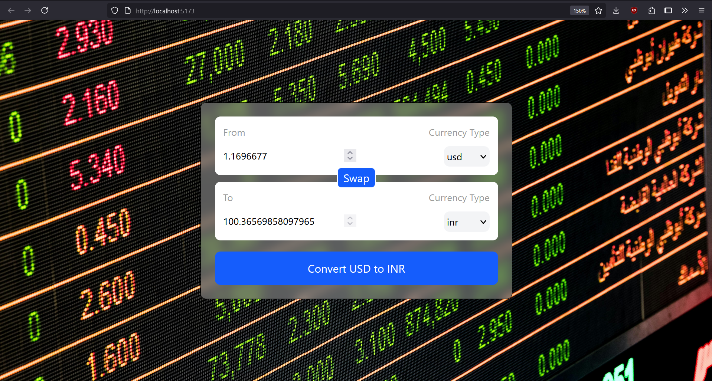

# 💱 Currency Converter

A simple, responsive currency converter built with **React**, **Tailwind CSS**, and a live exchange rate API. The user can input an amount, select source and target currencies, and convert between them using real-time data.


---

## 🚀 Features

- ✅ Real-time conversion using [Fawaz Ahmed's Currency API](https://github.com/fawazahmed0/currency-api)
- ✅ Swap functionality to reverse source and target currencies
- ✅ Dropdowns populated dynamically from the API
- ✅ Responsive layout with Tailwind CSS
- ✅ Pexels background image with blur effect for a modern look

---

## 🛠️ Tech Stack

| Layer        | Tech                      |
|--------------|---------------------------|
| Frontend     | React                     |
| Styling      | Tailwind CSS              |
| API          | Fawaz Ahmed's Currency API |
| Image Source | [Pexels](https://www.pexels.com) |

---


---

## 🧠 How It Works

1. **User inputs an amount** in the "From" field.
2. **Selects source and target currencies** from dropdowns populated using the API.
3. **Clicks Convert**, and the app fetches the exchange rate and multiplies it with the amount.
4. **Swap** reverses the direction and exchanges both amount and currency.

The conversion logic is handled with React state and the hook `useCurrencyInfo`, which fetches a live currency rates object every time the source currency changes.

---

## 🖼 Background

The background uses a financial stock board image from **Pexels**, applied via inline `style={{ backgroundImage: '...' }}` in the main wrapper div. A semi-transparent white container (`bg-white/30`) with blur (`backdrop-blur-sm`) overlays the background to maintain readability.

---

## 📸 Screenshot

The UI looks like this:



---

## 🧪 Getting Started

### 1. Clone the repo
```bash
git clone https://github.com/git-authority/currency-converter.git
cd currency-converter
```

### 2. Install Dependencies

```
npm install
```

### 3. Run the App

```
npm run dev
```

Then go to: http://localhost:5173


---

## 🔗 API Used

Fawaz Ahmed's Free Currency API

  - No authentication required

  - CDN-hosted JSON

  - Example endpoint:

  ```
  https://cdn.jsdelivr.net/npm/@fawazahmed0/currency-api@latest/v1/currencies/usd.json
  ```

  ---

## 🙋‍♂️ Author

#### Abhrasnata Ray - Feel free to reach out if you have suggestions or improvements!