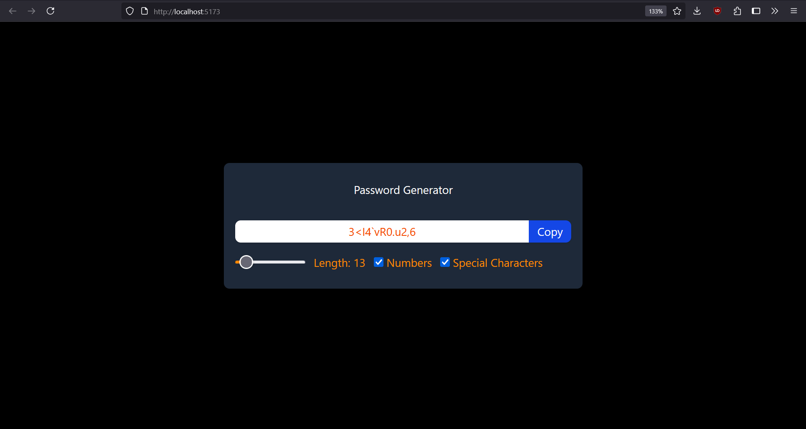

# 🔐 Password Generator

A simple and responsive password generator built using React and Tailwind CSS.
Customize the password length and include numbers or special characters. Copy the generated password to your clipboard with one click.

---

## ⚙️ Features

- Set password length using a range slider (6–100 characters)
- Option to include:
  - Numbers (`0–9`)
  - Special characters (e.g. `!@#$%^&*`)
- Instant password regeneration on option change
- One-click copy to clipboard
- Clean UI with responsive layout

---

## 🛠️ Tech Stack

- React
- Tailwind CSS
- React Hooks (`useState`, `useEffect`, `useCallback`, `useRef`)

---


---

## 🚀 Getting Started

```bash
npm install
npm run dev   # or npm start
```

## 📸 Screenshot

